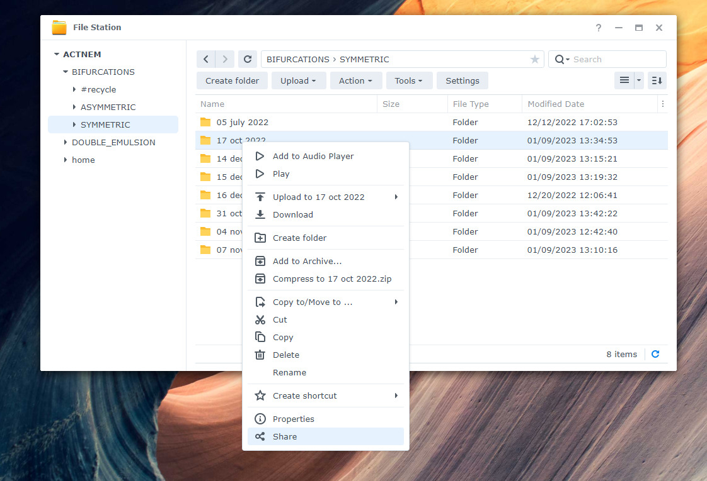
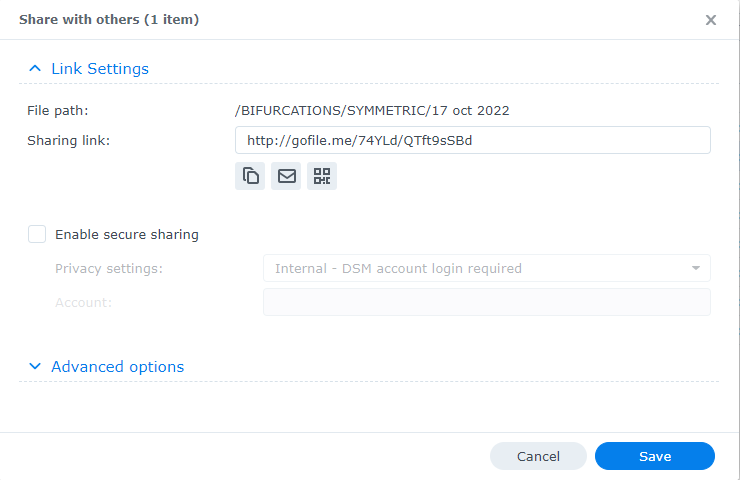
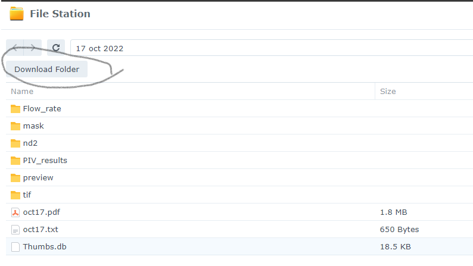
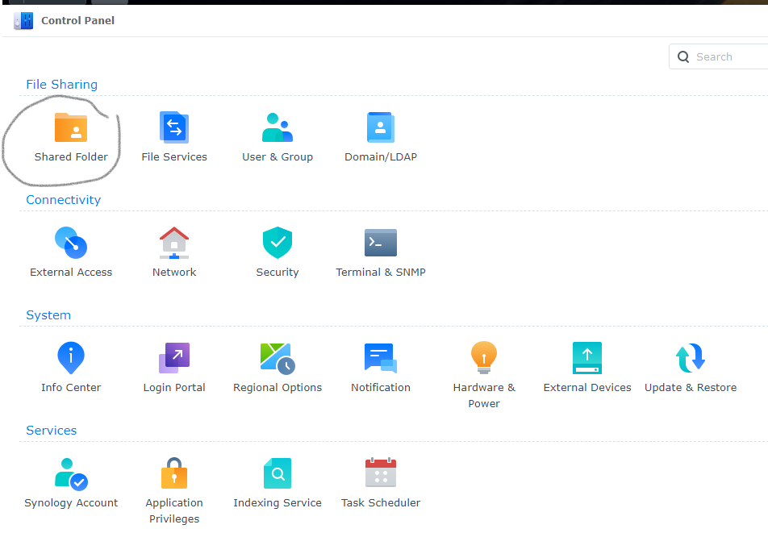
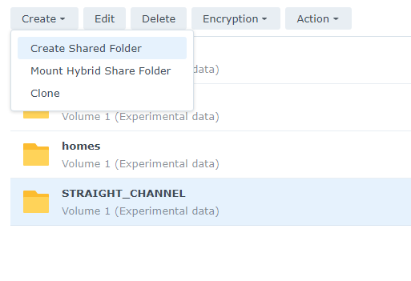
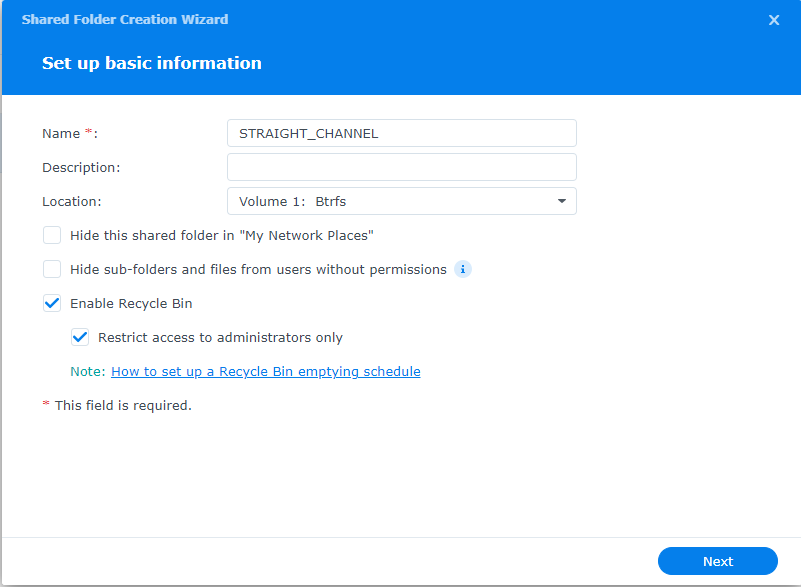

### NAS settings

I put the NAS under my desk in my office. The name is "ACTNEM" standing for active nematics. It is connected via an ethernet cable to a router in my office, so supposedly it is in the local network of ESPCI. Below are some key information:
```
Server name: ACTNEM
QuickConnect ID: actnem
IP address: 193.54.88.3
Default gateway: 193.54.88.1
DNS: 193.54.82.20
```

#### 1. Access

- From ESPCI local network (if your IP address is 193.54.88.xxx): https://193.54.88.3:5001/
- From external network: https://quickconnect.to/actnem

Then you need to input your credentials to login the system. I have created an administrator account:
```
username: labdamin
password: ActiveNemat1cs
```

  

After logging in with labadmin, you can head to "Control Panel" -> "User & Group" to create a new user with your preferred username and password. Once created, you can sign out the admin account and sign in with your newly created account. 

NOTE: Do not use the administrator account for daily use of the system.

#### 2. Upload files

Files can be transferred using "File Station" in the web interface by drag & drop files to shared folders.

  

To download, just right click on the file(s) and select download.

  

#### 3. Map network drive

It is convenient to map the drive to local file systems, so that we can access network files as if they are on my local computer. This can be achieved by SMB protocol. 

  

##### Windows 10

On windows computer, we can deploy the mapping by clicking "my PC" in File Explorer and then choose "computer" tab. 

  

Then click "Map network drive" -> "Map network drive". Choose a letter for the drive, and locate the network drive using "Browse".

  

For example, I choose letter `A:` for the shared folder `\\ACTNEM\bifurcations`, on my local computer it looks like

  

##### MacOS

To be tested.

#### 4. Share files to non-members

In the web interface, open "File Station". Select the file(s) or folder(s) you want to share, right click and choose "Share" at the bottom of the menu.

  

In the "Share with others (...)" window, copy the "Sharing link", then click "Save".

  

Then send the "Sharing link" to the person you want to share files with. By clicking on the link, he/she should be able to download the content you share.

  

#### 5. Create volume

We create a top level shared folder for a clearly defined project, e.g. bifurcation and the straight channel, and save small tests in the personal home directory to avoid spamming the shared spaces. To create a top level shared folder, login as "labadmin" (see step 1) to the web interface and open "Control Panel". Then select "Shared Folder".

  

Then click Create -> Create shared folder.

  

Then follow the create-wizard to specify the details for the folder. The most important things are the name and the permissions. Make sure to give only relevant users "write" permission.

  
