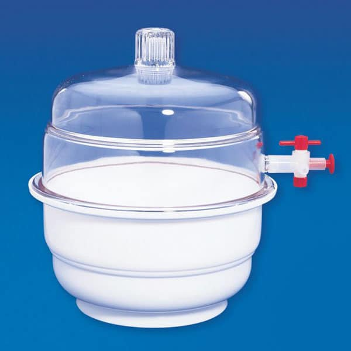

### Experiment log 1212-1216

The confocal was fixed last week, so I got the chance to work again on experiments with microtubules. The experiment last week was a mix of success and failure. I realized some subtle difference between my operations the the protocol that could prevent my experiment from working. And there are still problems I do not understand. 

In this note, I document the things I have learned and the things that are left to be investigated further.

#### 1. Acrylamide coating is the key

> Polymerized acrylamide provides a sterically repulsive brush which prevents proteins, in this case our motors Kinesin, from sticking to glass surface. It also provides a hydrophilic surface. 

Without this brush, Kinesin will mostly stick to the glass, so that we have much less motors at the water-oil interface. This has been the primary reason that we observe weak or no activity of microtubules, most of the time. 

It is possible that we add everything right according to the protocol, and we still don't get the polymer brush. This is because we need to ensure the polymerization reaction happens. In the case where the initiator (ammonium persulfate, APS) does not function, the polymerization reaction can hardly happen. This is why, we always degas the acrylamide solution for half an hour before putting glass slides in it. The oxygen dissolved in water can easily capture the radicals generated by APS and make the reaction initiation less effective. This is also why we add APS at the moment we are ready to pour the acrylamide solution into the glass slide container.

Even if we handle the aforementioned aspects well:

- we degas the acrylamide solution well
- we add APS at the right moment

the coating can still fail, because APS is extremely soluble in water, and can absorb moisture from surrounding air very quickly. A newly ordered APS is usually in powder form, but I realized that all the APS stocks we have in the chemical cabinet has already lost the powder form. Instead, it forms big aggregates of wet "mass". According to [a wiki page on sciencemadness](http://www.sciencemadness.org/smwiki/index.php/Ammonium_persulfate):

> Amonium peroxydisulfate should be stored in closed bottles or bags, away from moisture, acidic vapors or organic materials, preferably in a dark and dry environment. Ammonium persulfate does not store very well, and will become a wet mass, with little oxidizing potential after at least two years of storage.

It is likely that our stocks of APS is already not as effective as when it was fresh. So keep in mind that if bad APS is used, and experiment does not work, then buy new APS should be the first troubleshoot.

This quote also suggests that our current storage of APS is problematic: APS should be stored away from moisture, acidic vapors or organic materials. However, in our chemical cabinet, we have acetic acid right next to the APS bottle, and organic polymers all around the APS bottle. This further shortens the shelf life of APS, which is already very short. 

A good practice would be to put APS bottle in a dedicated desicator, with no acetic acid or organic compounds around. 

  

Although all the APS stocks show this wetting issue, the severity is different. I found a small bottle of APS which looks better in terms of aggregation, so I tried it for the coating. Indeed, this batch of coated glass slides gave me active microtubules, finally. 

#### 2. Temperature is a weak factor

This winter, I observe the temperature to be around 15$\degree$C in the imaging room in the morning. I start to use the heater next to the confocal to heat up the room, and it was working. Within an hour, it can increase the temperature from 15 to 17$\degree$C. In 3 hours, the temperature in the small area around confocal stabilizes at 20$\degree$C. 

I observe that at 15$\degree$C, the MT does not show activity. The same sample start to show fluxes and defects when $T=17\degree$C. On another day, when I load the sample at 20$\degree$C, the activity was immediately on.

However, the frequently observed failures should not be due to temperature, because we normally have 17$\degree$C, at which temperature we should at least see a little bit of motion. Therefore, temperature in our case is a weak factor, and should not be the leading cause of experiment failure.

#### 3. Puzzling shelf life of coated glass slides

The protocol from both Claire and Dogic lab state that the glass slides coated with acrylamide brush are good for use within several weeks after preparation. However, the good batch of glass slides worked for 2 days, and failed on the third day. 

I understand that when an experiment does not work, causes can be very diverse. To rule out other factors, I have tried multiple active solution aliquots, MT aliquots and PEP aliquots. None of them made the experiment work again. So I doubt that the problem is still with the glass slides. Maybe the shelf life is shortened by the bad APS. 

#### 4. Inconsistencies in existing protocols

I'm primarily following Claire's protocol, but am also aware of the protocol from Dogic lab. They are very similar in many aspects, but they do have subtle differences as well:

- After the silane bath, Claire's protocol goes like

>  empty the cuves (holding the glass slides inside as usual), and immediately pour the acrylamide solution inside

while Dogic lab's protocol says

> Rinse 3-5 times with DI water. Proceed to polymerize Acrylamide off of silane coated glass.

There is a rinse step missing. I'm not sure if it has any impact on the final coating. 

- Claire's protocol gives me a feeling like I should prepare the acrylamide solution, wait the silane bath, and immediately pour the acrylamide solution into the container once silane bath is emptied. However, Dogic lab's protocol suggests to pour the acrylamide solution immediately after preparation. Although both documents use "immediately", the meanings are different. Personally, I think Dogic lab protocol makes more sense, since once APS is added, the polymerization should start and we want it to start on the glass slides. We should probably modify the wording of Claire's protocol.