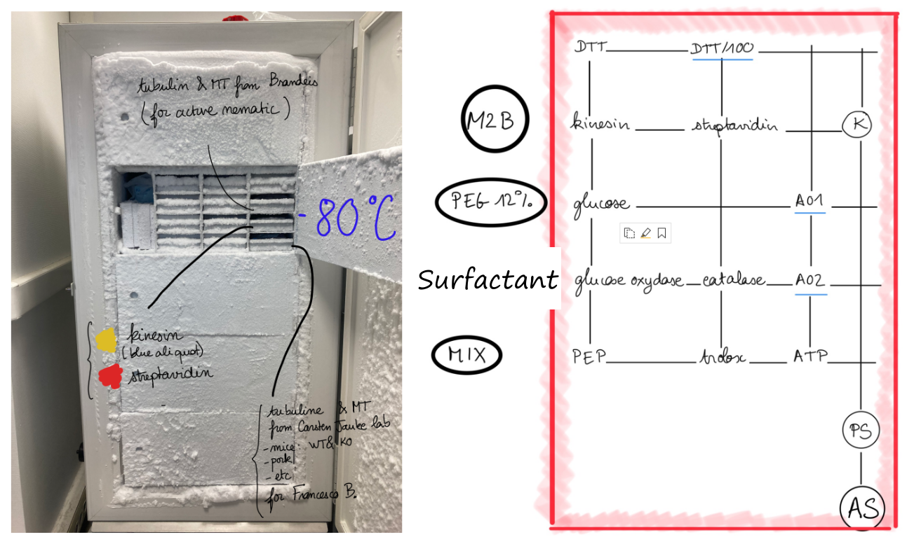

### Protocol: Self-propelled Emulsions of Active Nematics

This protocol documents the experimental procedures to create emulsions of active microtubules in a passive liquid crystal medium (typically 5CB). In cases where 5CB is aligned unidirectionally by treated boundaries, the active emulsions exhibit unidirectional self-propulsion along the liquid crystal director.

**References**
1. Clairand 2021 (PhD thesis)
2. [Guillamat 2018](https://www.science.org/doi/10.1126/sciadv.aao1470)

#### Part I: Glass slide preparation

##### Rubbed PVA: unidirectional planar anchoring

**Ingredients**

- 3 wt% PVA solution
- 1.5 x 1.5 cm$^2$ glass slides
- spin coater
- Oven or hot plate (150$\degree$C)
- a soft velvet

**Steps**

1. Spin coat 3 wt% PVA solution at 3000 rpm for 30 s on two 1.5 x 1.5 cm$^2$ glass slides.
2. Heat the coated glass at 150$\degree$C for 30 min.
3. Rub unidirectionally the coating using a soft velvet.

##### Aquapel: perpendicular anchoring

(to be done)

#### Part II: Active solution preparation

*NOTE: the formula here is similar to the one used for interfacial active nematics, except the type of surfactant used. Be mindful of the desired anchoring condition when choosing surfactant. The following table shows the correspondence between anchoring types and surfactant types.*

| Anchoring type | Surfactant                     | Concentration       |
|----------------|--------------------------------|---------------------|
| Planar         | Pluronic F-127                 | 1-3% (w/v)          |
| Conic          | Tween 80                       | 5-10% (w/v)         |
| Homeotropic    | DSPE-PEG Mixtrues              |  0.2% (w/v)         |
| Homeotropic    | Tween 20                       |  3 v%               |  

**Ingredients**

- Fridge (4°C) chemistry room
  - M2B (buffer)
  - Mix
  - PEG at 12% (what concentration?)
  - Tween 20 at 93 v% (corresponding to 93.5 wt%) (This concentration could be viscous and therefore difficult to manipulate with small pipitte)
- Freezer -20°C chemistry room
  - PEP
  - Trolox
  - DTT
  - ATP
  - Glucose oxydase (yellow)
  - Catalase (slightly green)
  - Glucose
  - PKLDH: enzymes to regenerate ATP, has to stay as less as possible out of the freezer)
- Freezor -80°C biology room
  - kinesin (molecular motor) yellow sticker, in 10 µL blue aliquots
  - streptavidin (to bind kinesins) red sticker
  - Microtubules (MT)

To avoid confusing the aliquots, place them according to this map representing the red metallic tray :

**Steps**

1) Dilute x100 DTT:

   49.5µL M2B + 0.5µL DTT = DTT/100

2) Prepare motors K : add to the aliquot that contains the kinesin:

    M2B (10 µL) + streptavidin (2 µL) + DTT/100 (1 µL)

    Vortex and let them sit on the metallic tray for 30 min. The cold will help streptavidin-kinesin bindings. Meanwhile proceed to the next step :

3) AO1 and AO2
    - 5 µL glucose + 5 µL DTT = AO1
    - 5 µL glucose oxydase + 5µL catalase = AO2

4) Prepare pre-solution PS by mixing :
    - 8 µL PEG
    - 8 µL PEP
    - 6 µL Trolox
    - 2.9 µL Mix
    - 1.7 µL ATP
    - 1.5 µL Surfactant stock solution (Tween 20 at 93 v%)
    - 1.33 µL AO1
    - 1.33 µL AO2
    - 1.7 µL PKLDH (at the last minute)

    Vortex PS

5) Active solution AS:

    15 µL of K + 31.5 µL of PS = AS

    Dispatch AS in aliquots of 2.5 µL each. Close well each of the aliquots. Place them inside an Eppendorf falcon, label and store at -20°C in the freezer. Can be used without any issue for 1 month.

*NOTE: label the active solution with the name of the surfactant supplemented!*

#### Part III: Active nematics emulsions (in liquid crystal 5CB)

##### Mechanical mixing (shaking)

**Ingredients**

- 5CB
- Active solution AS
- Microtubules (MT)
- PEP
- Glass slides coated with PVA
- Double sided tape (90-140 $\mu$m thick)

**Steps**

1. Add 100 $\mu$l 5CB to a 1.5 ml plastic tube.
2. Active nematics (AN):

   2.5 $\mu$l AS + 0.5 $\mu$l MT + 0.5 $\mu$l PEP = AN

3. Add all AN to the 5CB tube.
4. Vortex the mixture for 10 s (tentative), to make emulsions
5. Transfer the emulsions to the pool of glass slide and double sided tape.
6. Close the pool with another glass slide on top.

##### FemtoJet

(to be done)
