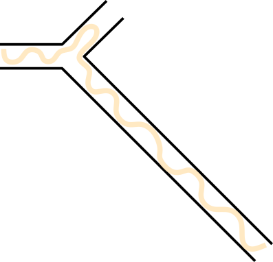
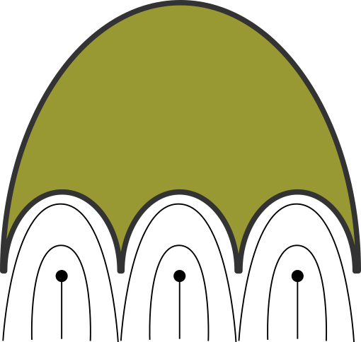

# AN
 Active nematics project repo @ Gulliver lab with Teresa Lopez-Leon.

 There are a few topics to investigate:

 - [ ] Spontaneous flow to longer path - bifuraction

 - [ ] Active nematic droplets in liquid crystal

 - [ ] Transport of "ghost" in active nematics

Perry Ellis' PhD thesis for detecting defects.
