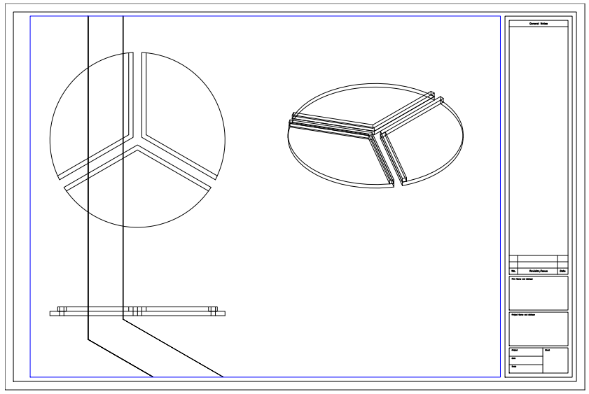
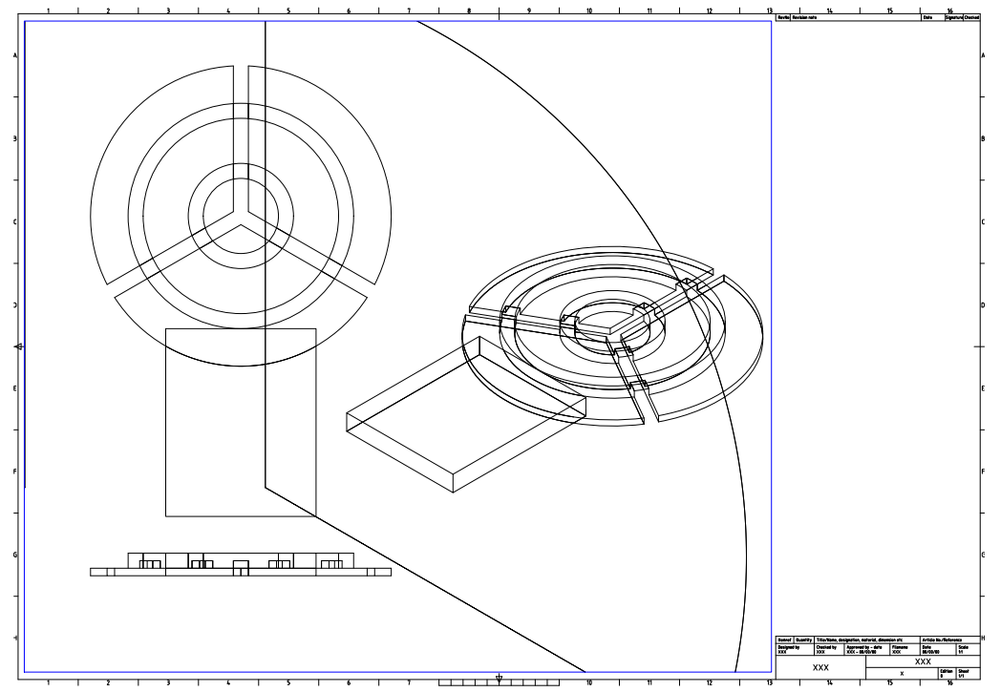
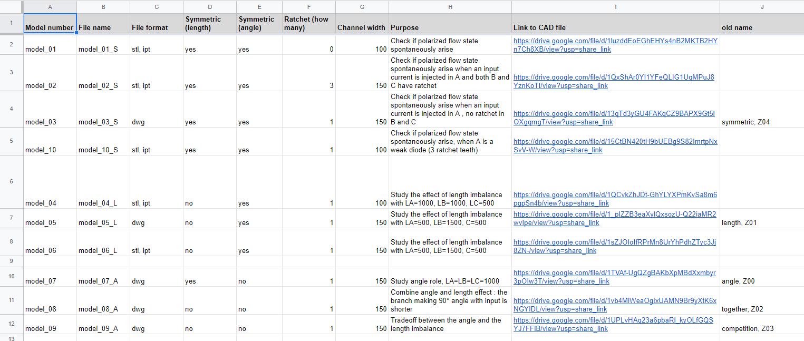
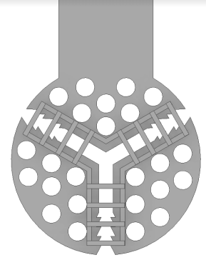
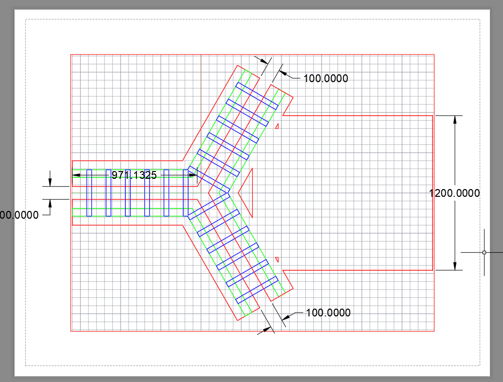

### AutoCAD notes

- First try of the 3-node design

- an idea to reuse design: design a base (circular), then subtract a channel out of the base. For example, the following design can be made by simply subtract a premade base:

- To create a different design, just subtract the cylinder with the channel shape (200 um height).

##### Update on Dec 13, 2022

I started to write this note when I just came back from Corsica to start working on active nematics. After 2 months of working and training, I improved much on using AutoCAD and the intuition of what kind of grid design might work. As a result, the "ideas" above now look naive to me. Claire and I have created a repository to deposit our designs for experiment planning and future reference. I take this note as an opportunity to describe this repo.

##### The repo 

The repository is hosted on Google Drive as a shared folder. 

  

We have put all our design files (.ipt, .dwg, .stl) in this shared folder. We also generated a PDF file for each design, so we can easily preview what we already have tried. 

Detailed information of the design are summarized in a spreadsheet called 
`Bifurcations_designs`. Here, we give each design a unique `model number` and explain the purpose of it. 

  

##### Minimal design

In the past, Claire always had a circular disk as the host of channels. A typical design looks like this:

  

Recently, I want to test if it is possible to further reduce the material amount of the grid, so that we can 
- minimize the effect of grid on the interface,
- save some printing time.

Therefore, I made the following minimal design as the first try. Note that the channel part is identical to Model 01, so I still tend to call it Model 01, but with a note that it is a minimal design. 

  

Hopefully, this design can improve the quality of channel flow. 